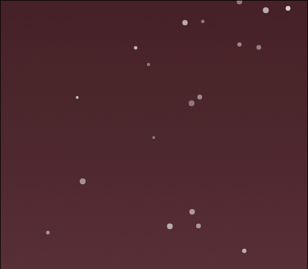
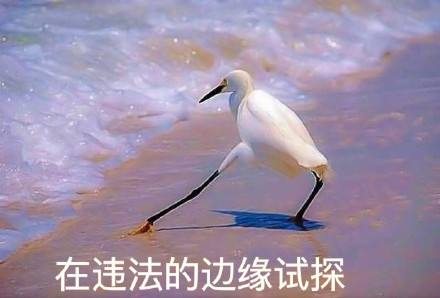

动态桌面的制作
=======
**这是一篇总结的文档**

.png)
这里将会讲述的是上述动态桌面的制作历程 
**从完全不会html的小白到大佬！**

[[toc]]

# 首先需要一个Wallpaper Engine
---

## 轻松实现动态桌面

这里不需要多说，这是我在steam上花的最值的18块钱
然后steam上是支持把网页作为动态桌面的

这样就有实现这一伟大构想的技术支持

## 优质资源太少

现在在网上的许多资源（尤其是下载量大的）基本是vedio主题，即在桌面上无限循环一段制作好的视频。这种方式的主要问题是源文件过大，**因为要想得到能在桌面上看的高清视频，源文件必须得大**。比如在Wallpaper Engine上评分最高的"Reimu with music 灵梦音乐版 1080 60FPS" 占用419MB。
> ”这样没下载几个主题，Wallpaper Engine就拥有比肩3A大作的磁盘占用。“——鲁迅

那么少数的Web主题呢？
首先是功能太臃肿，有很多功能在实际使用的过程中是用不到的。
其次是GPU占用巨**TM**大，有时能去到100%，*我也不知道怎么做到的*。
最后，也是最重要的，没有交互，也就是说：**你不能调戏你的桌面。**


## 与某个网站的孽缘

没错，我就是在说：[https://imjad.cn/](https://imjad.cn/)
这个大佬把我这个动态桌面的特效都介绍了，我制作的主要过程都基本上参考这个网站的
至于怎么发现的？**一开始我本来是想做python爬虫的啊**
然后发现大佬的参考资料那里有那个
所以我访问了那个网
所以那个爬虫我到现在都没动。*（现在是2018年1月11日 19：35）（京紫元年第一天）*

# 前期的准备工作
---

## 你得知道一个网页是怎么的编的

至少你要会写一个“hello world”，比如像这样：

```Html
<!DOCTYPE html>

<html  lang="en">

<head>

<meta  charset="utf-8">

<title>Hello, HTML5!</title>

<link  rel="stylesheet"  href="style.css">

<script  src="app.js"></script>

</head>

<body>

<h1>Hello,HTML5!</h1>

</body>

</html>
```
大致结构是要懂的，不然你连怎么搞个网页都不懂（笑）

## 你要看得懂Javascript

当然要求只是能看懂，包括看懂它到底编的是嘛玩意儿，还有看懂它到底出了什么错
通常你把C或C++学得比较好就基本上不会有阅读问题了。*实在不会上网查资料啊*
**一定要会看报错！**
**一定要会看报错！**
**一定要会看报错！**
重要的事情要说三遍，多年的心酸血泪史

# 雪花特效

这里主要参考的是[大佬](https://imjad.cn/archives/code/sounds-winter-and-snowflakes-are-more-compatible)的文章（其实这里所有东西都基本上参考大佬的文章）
在网页合适的地方加入以下代码
```html
<canvas id="Snow"></canvas>
```
然后引入js（另建js或者在html里写都行）
```javascript
(function() {
    var requestAnimationFrame = window.requestAnimationFrame || window.mozRequestAnimationFrame || window.webkitRequestAnimationFrame || window.msRequestAnimationFrame ||
    function(callback) {
        window.setTimeout(callback, 1000 / 60);
    };
    window.requestAnimationFrame = requestAnimationFrame;
})();

(function() {
    var flakes = [],
        canvas = document.getElementById("Snow"), //画布ID，与上一步创建的画布对应
        ctx = canvas.getContext("2d"),
        flakeCount = 200,  //雪花数量，数值越大雪花数量越多
        mX = -100,
        mY = -100;

    canvas.width = window.innerWidth;
    canvas.height = window.innerHeight;

    function snow() {
        ctx.clearRect(0, 0, canvas.width, canvas.height);

        for (var i = 0; i < flakeCount; i++) {
            var flake = flakes[i],
                x = mX,
                y = mY,
                minDist = 150,  //雪花距离鼠标指针的最小值，小于这个距离的雪花将受到鼠标的排斥
                x2 = flake.x,
                y2 = flake.y;

            var dist = Math.sqrt((x2 - x) * (x2 - x) + (y2 - y) * (y2 - y)),
                dx = x2 - x,
                dy = y2 - y;

            if (dist < minDist) {
                var force = minDist / (dist * dist),
                    xcomp = (x - x2) / dist,
                    ycomp = (y - y2) / dist,
                    deltaV = force / 2;

                flake.velX -= deltaV * xcomp;
                flake.velY -= deltaV * ycomp;

            } else {
                flake.velX *= .98;
                if (flake.velY <= flake.speed) {
                    flake.velY = flake.speed
                }
                flake.velX += Math.cos(flake.step += .05) * flake.stepSize;
            }

            ctx.fillStyle = "rgba(255,255,255," + flake.opacity + ")";  //雪花颜色
            flake.y += flake.velY;
            flake.x += flake.velX;

            if (flake.y >= canvas.height || flake.y <= 0) {
                reset(flake);
            }

            if (flake.x >= canvas.width || flake.x <= 0) {
                reset(flake);
            }

            ctx.beginPath();
            ctx.arc(flake.x, flake.y, flake.size, 0, Math.PI * 2);
            ctx.fill();
        }
        requestAnimationFrame(snow);
    };

    function reset(flake) {
        flake.x = Math.floor(Math.random() * canvas.width);
        flake.y = 0;
        flake.size = (Math.random() * 3) + 2;  //加号后面的值，雪花大小，为基准值，数值越大雪花越大
        flake.speed = (Math.random() * 1) + 0.5;  //加号后面的值，雪花速度，为基准值，数值越大雪花速度越快
        flake.velY = flake.speed;
        flake.velX = 0;
        flake.opacity = (Math.random() * 0.5) + 0.3;  //加号后面的值，为基准值，范围0~1
    }

    function init() {
        for (var i = 0; i < flakeCount; i++) {
            var x = Math.floor(Math.random() * canvas.width),
                y = Math.floor(Math.random() * canvas.height),
                size = (Math.random() * 3) + 2,  //加号后面的值，雪花大小，为基准值，数值越大雪花越大
                speed = (Math.random() * 1) + 0.5,  //加号后面的值，雪花速度，为基准值，数值越大雪花速度越快
                opacity = (Math.random() * 0.5) + 0.3;  //加号后面的值，为基准值，范围0~1

            flakes.push({
                speed: speed,
                velY: speed,
                velX: 0,
                x: x,
                y: y,
                size: size,
                stepSize: (Math.random()) / 30 * 1,  //乘号后面的值，雪花横移幅度，为基准值，数值越大雪花横移幅度越大，0为竖直下落
                step: 0,
                angle: 180,
                opacity: opacity
            });
        }

        snow();
    };

    document.addEventListener("mousemove", function(e) {
        mX = e.clientX,
        mY = e.clientY
    });
    window.addEventListener("resize", function() {
        canvas.width = window.innerWidth;
        canvas.height = window.innerHeight;
    });
    init();
})();
```
最后引入style
```css
#Snow{
    position: fixed;
    top: 0;
    left: 0;
    width: 100%;
    height: 100%;
    z-index: 99999;
    background: rgba(125,137,95,0.1);
    pointer-events: none;
}
```
因为这是基于原生的js，所以实现的难度不大，基本上能一次调通
效果就像这样

这么稀疏是因为我把数量参数调成了150

# live2d的绘制
---

## 把程序调通

这里首先参考的是下面几篇文章：
[给博客添加能动的看板娘(Live2D)-关于模型的二三事](https://imjad.cn/archives/lab/add-dynamic-poster-girl-with-live2d-to-your-blog-01)
[给博客添加能动的看板娘(Live2D)-将其添加到网页上吧](https://imjad.cn/archives/lab/add-dynamic-poster-girl-with-live2d-to-your-blog-02)
[Live2D Web端实现](http://blog.csdn.net/kakinuma/article/details/50697762)
对于前两篇，大佬的做法是基于Linux平台的，所以他介绍的库在windows下**不能使用**
所以他给的**根本调不通**
当时我也是懵逼的
所以我选择先看第三篇，用[官方](http://sites.cybernoids.jp/cubism-sdk2_e/webgl2-1)的版本来研究架构
这里推荐使用的路径：
```
Live2D_SDK_WebGL_2.0.05_1_en\sample\SampleApp1\SampleApp1.html
```
选这个的原因是更贴近我的最终版本
而且代码能看
当然，这个一开始也是不能正常运行的，具体表现为：Edge能正常运行，Chrome不能
至于IE？太旧不支持🙄
Chrome不能正常运行主要有两个问题
首先Chrome默认是不能挂载外部文件，报错如下：
```
Failed to load file://path/to/haru.model.json: Cross origin requests are only supported for protocol schemes: http, data, chrome, chrome-extension, https.
PlatformManager.loadBytes @ PlatformManager.js:37
```
这是基于安全考虑，不是chrome本身的问题
解决方法是先把chrome关了，然后在控制台输入以下代码：
```cmd
cd path\to\chrome.exe
.\chrome.exe --allow-file-access-from-files
```
就是允许挂载的启动方式
然后就是第二个问题：
```
PlatformManager.js:33 Failed to load (0) : assets/live2d/haru/haru.model.json
```
这个就是chrome本身机制的问题，这个问题出在源文件"PlatformManager.js"中
以下就是发生错误的代码段
```javascript
//============================================================

// PlatformManager # loadBytes()

//============================================================

PlatformManager.prototype.loadBytes  =  function(path/*String*/, callback)

{

var  request  =  new  XMLHttpRequest();

    request.open("GET", path, true);

    request.responseType  =  "arraybuffer";

    request.onload  =  function(){

        switch(request.status){

        case  200:

            callback(request.response);

            break;

        default:

            console.error("Failed to load ("  +  request.status  +  ") : "  +  path);

            break;

        }

    }

    request.send(null);

    //return request;

}
```
问题出在对象*XMLHttpRequest*中，这里加载过程是正常进行的，但是在*request.status*这一块，Edge是返回正常值200，但是chrome返回的是没响应的值0，所以就报错了
但这段实际上是**加载成功**了的，而且在标准中也不该出现*status*为0，这是chrome抽风了（甚至可以说是大多数用相似内核的浏览器，当然包括Wallpaper Engine，都会抽风）。发现错误之后，改就简单了，把相关代码都注释掉就行了😂，就像这样：
```javascript
//============================================================

// PlatformManager # loadBytes()

//============================================================

PlatformManager.prototype.loadBytes  =  function(path/*String*/, callback)

{

var  request  =  new  XMLHttpRequest();

    request.open("GET", path, true);

    request.responseType  =  "arraybuffer";

    request.onload  =  function(){

    //  switch(request.status){

    //  case 200:

            callback(request.response);

    //      break;

    //  default:

    //      console.error("Failed to load (" + request.status + ") : " + path);

    //      break;

    //  }

    }

    request.send(null);

    //return request;

}
```
然后就是见证奇迹的时刻

第三篇文章就是告诉你怎么在这个基础上换上自己的素材的
实际上，上述错误就是**大部分构建好的版本的错误**，只要找到相应出错的地方，改代码就行了（虽然找到那个位置也是极难的）

## 加入鼠标跟踪

找到了这个关键的错误，其他方面就方便了，就上网找构建好的版本，接口id沿用原来的就行了
这里用的是[项目hexo-helper-live2d](https://github.com/EYHN/hexo-helper-live2d)，这玩意儿在windows环境下没法构建，所以别按照Readme.md中的去做，而是使用其中dist文档中的demo，它的js文件就是构建好的版本，把错误改了就能用了
这是效果：

构建的版本推荐大佬的，因为这个模型的有些缺陷都解决了，而且加上了点击效果和睡觉效果（绅士笑.jpg）。把错误和文件名改了拉过去就能用了

## 加入事件的响应

参考网站
**这是有信心能自己弄好的**
[给博客添加能动的看板娘(Live2D)-将其添加到网页上吧](https://imjad.cn/archives/lab/add-dynamic-poster-girl-with-live2d-to-your-blog-02)
**这是对自己网页编程没信心的**
[Live2D！把可爱的看板娘捕捉到你的博客去吧](https://haremu.com/p/205)
那里也有构建好的版本，出错的问题同上文（我都怀疑是不是自己的环境有问题了……）

## 更多的衣服

### 获取贴图

可以发现我没有使用官方给的模型（丑得一匹），素材取自Android游戏《药水制作师》，大佬的文章很详细地把怎么解包的过程都教了，你只需要：
* 下一个破解版
* 安装
* 进游戏把衣服都解锁了
* 按大佬说的去做

就完了😝

### 换衣服

要说换衣服，就要提到模型的构成
动作文件```model.moc```存放的是动作信息，实现动作用的
模型文件```model.json```存放的是模型信息，调用相关文件用的
有三个重要的组件
* "textures"存放的是贴图路径
* "hit_areas_custom"是点击的相应范围
* "motions"存放的是动作文件的路径
换装有两种途径：
一是通过代码实现，因为贴图的路径是被完整读取的，所以只要写一个换装的函数就行了
二是直接改贴图的路径，这样可以直接换装，但没换装功能了
效果如下：


## 自己动手绘制贴图

当你阅衣无数后，就想自己制作一个自己的贴图
> ”只有像这篇作者一样无聊才会想着做这些事！“——对就是鲁迅说的

你可以发现，每个贴图文件中各个组件都有自己固定的位置，就像下图

也就是通过修改这些图片就能有换贴图的效果
而你解包的80多个贴图文件就是你的”零件“，如何发挥好就看你的艺术细胞了
而相应的```model.moc```文件给出的是各个贴图的剪切范围，而很多组件是留了余量的，也就是说，你可以**在规定的范围发挥你的想象力**

我爆改的贴图文件——二小姐大人。中间所有的素材都是我从别的贴图文件扣的或者改的，工具嘛，photoshop！

然后就是我的成品了


# 后记
---
这是我写了”hello_world.html“后写的第二个html的项目，其中遇到了许多困难，一开始我只是把雪花效果加上去，然后再写一个显示时间的小组件就收工了。然而！之后在偶然间发现了XMLRequest()这个万恶之源之后，我就控几不住计己辣（微笑脸）
嗯于是一步步走向了这个项目的深坑，从模仿到最后做出了属于自己的东西，算是这两个星期的收获吧。
感谢[@猫与向日葵](https://imjad.cn/archives/lab/add-dynamic-poster-girl-with-live2d-to-your-blog-02)的教程
**这些个人博客超级炫酷的！**
* 另：最后的版本在Edge上运行不了（懒得改了）